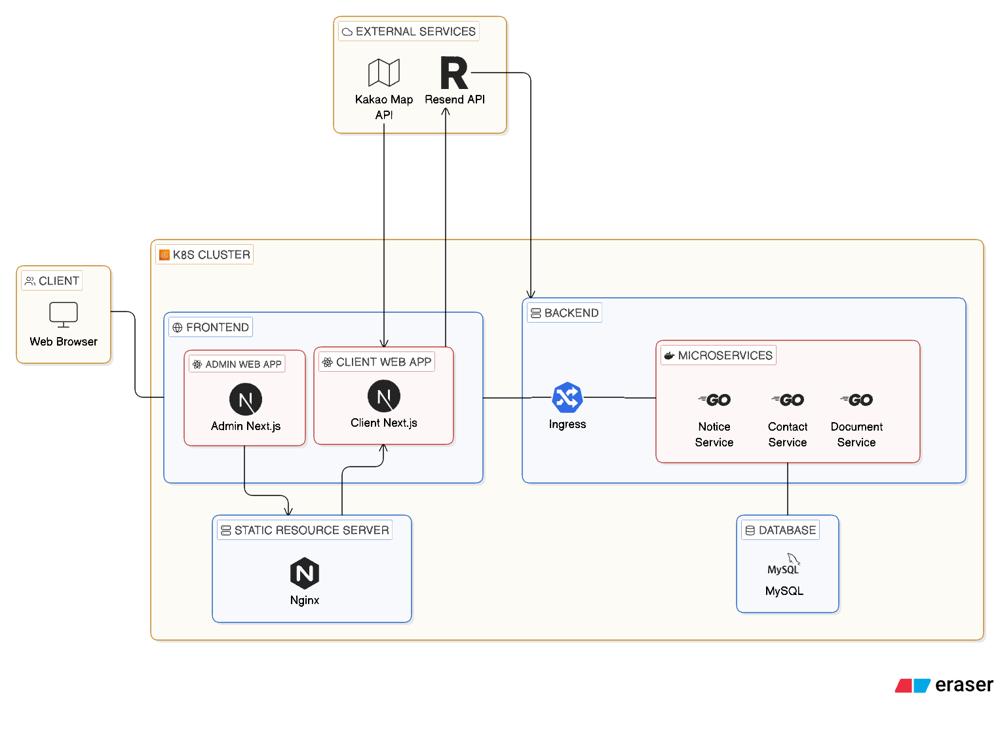
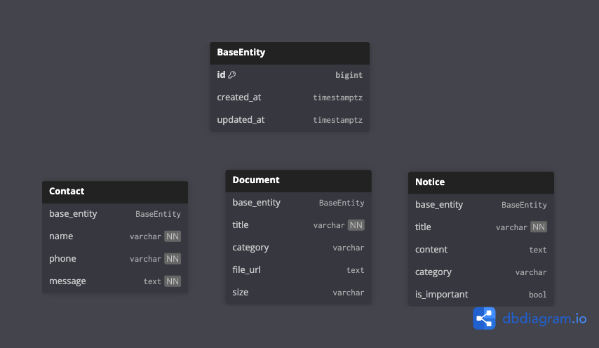

# 한우세무법인 동대문점 웹사이트 및 관리자 페이지

본 프로젝트는 GPL-3.0 라이센스를 따릅니다.

한우세무법인 동대문점의 웹사이트 및 관리자 시스템을 구축하기 위한 외주 프로젝트입니다.

- 상담 문의 신청 시 이메일 자동 전달 및 관리자 페이지에서 확인

- 공지사항 및 문서 업로드와 관리

위와 같은 문제를 해결하고자 하였습니다.

## Contract

- [SW종사자 표준도급계약서](https://spri.kr/posts/view/23132?code=information)

- 과업내용서(따로 양식 생성 필요)

- [표준비밀유지계약서](https://mss.go.kr/site/smba/ex/bbs/View.do?cbIdx=81&bcIdx=1031902)

- [개인정보처리위탁 계약서](https://share.google/JyGWqBi9g8lEebgE3)

- 검수확인서(따로 양식 생성 필요)

## 문제 정의

1. 상담 문의가 이메일 또는 전화로 수작업으로 제한된 시간에만 접수되어 관리가 어려움

2. 문서를 직접 수작업으로 관리

이러한 문제를 해결하기 위해

- 상담 문의 관리 시스템

- 공지사항 및 문서 관리 시스템

- 관리자 페이지 기반 콘텐츠 관리

기능을 제공하는 웹 서비스를 구축하였습니다.

## System Architecture

아키텍처는 다음과 같은 구조로 설계했습니다.

    Client
    ↓
    Nginx Ingress
    ↓
    Frontend (Next.js)
    ↓
    Backend API (Go Gin)
    ↓
    MySQL

파일 업로드는 nginx static server로 분리하여 처리했습니다.

## Tech Stack

- Front-end: Next.js (App Router), TypeScript, Tailwind CSS

- Back-end: Go (Gin Framework)

- Database: MySQL

- Infra: Docker, Nginx, Kubernetes

- External API: Kakao Map API, Resend API

- Cloud: AWS EC2

### Go (Gin)를 선택한 이유

- 높은 동시성 처리, 빠른 성능

- 단순한 REST API 구조에 적합

- 낮은 메모리 점유율과 경량 컨테이너 이미지로 컴퓨팅 리소스 소비 최소화

### Next.js를 선택한 이유

- 서버 사이드 렌더링을 제공하여 검색 엔진 최적화 가능(검색 시 최상단에 뜰 확률이 높아짐)

- 풀스택 프레임워크로, 필요한 경우 간단한 자체 API 개발 또는 테스트 가능

### k8s 도입 이유

- 확장성과 안정성, 특히나 파드 리커버리를 통해서 서비스 다운 시 자동 재시작이 가능

- 복잡한 MSA 인프라를 한번에 해결 가능(Gateway, Load Balancer, Service Discovery, Service Mesh 등)

## Expected Future

비용이 허락하거나, 또는 트래픽이 많이 몰린다면 클라우드 인프라로 완전 자동화를 고려하고자 합니다.

- Terraform으로 클라우드 인프라 관리 

- EC2에서 k8s cluster를 돌리는 구조에서 AWS EKS로 이미지만 업로드하는 완전 자동화

- MySQL RDBMS 컨테이너에서 AWS RDS MySQL Aurora로 데이터를 마이그레이션, DB 관리 및 백업 자동화

- Static Resource Server를 Nginx Container로 운영하는 것에서 AWS S3 Data Storage Service로 데이터 관리 자동화 및 클라우드 서비스로 전환

## 인프라 상세 

Container -> Docker Compose -> k8s Kind(현재 단계) -> k8s cluster 순으로 진행 중

- Storage: Nginx에서 resource를 persistan volume claim으로 저장하여 관리함

- network: Ingress-nginx controller 기반 라우팅

- External API: 카카오맵 API, Resend API

## Trouble Shooting

1. 파일 업로드 시 관리 문제

    원인 : 관리자 페이지에서 파일을 nginx 리소스 서버에 저장하고 다시 파일을 스트림을 통해 클라이언트로 보내는 과정에서 파일 유실 또는 보안상의 이유로 차단되는 경우가 발생

    해결 : Persistant Volume Claim을 사용하여 리소스 서버와 프론트엔드 웹 서버들이 같은 저장소를 바라보게 하여 파일 스트림을 사용한 중계 방식을 사용하지 않아 애플리케이션 레이어에서 발생하는 네트워크 전송 비용을 줄였습니다.

2. Go의 Model, Repository, Service, Handler 중복 문제

    원인: client나 admin 모두 같은 Entity의 같은 서비스를 접근한다는 점에서 똑같은 코드를 중복해서 작성해야 하는 문제 발생

    해결: pkg/common으로 묶어서 하나의 코드로 통합

3. Docker 이미지 빌드 시, CPU 아키텍처에 따른 불일치

    원인: Docker가 이미지 빌드 시에 CPU 아키텍처에 따라 다르게 생성되는 문제가 발생.

    해결: 두 가지 방법이 있는데, 하나는 AWS 등의 x86 아키텍처를 가진 클라우드 호스트에서 이미지를 빌드하거나, Dockerfile에서 x86으로 빌드를 강제하도록 설정함.
    
    후자의 경우, 테스트하기에 번거로움이 있어서 전자를 사용하거나, Raspberry Pi 등의 x86 CPU 아키텍처를 호스트에서 따로 이미지를 빌드함

4. .env와 docker-compose environments 충돌

    원인: 원래는 docker-compose environments의 변수가 최우선적으로 적용되나, 도커 레이어와 캐시 등의 문제로 .env에 정의된 변수값들이 적용되는 문제가 발생

    해결: docker-compose environments를 아예 쓰지 않고, .env에 모든 변수를 정의하거나, 아예 브랜치를 하나 만들어서 .env를 쓰지 않고 docker-compose environments 변수만을 사용하는 방법으로 해결

5. Next.js에서 서버와 클라이언트 경계 모호화

    원인: Next.js는 풀스택 프레임워크로, 클라이언트의 기능을 수행하면서도 동시에 서버로서 기능도 가능하기에, 그 범위가 명확해지지 않아 코드가 어디서 실행되는지 불명확해지는 문제가 발생함.

    해결: UI등의 정적인 요소들은 클라이언트로, 이벤트나 서버와의 통신은 /app/actions에서 'use server'를 사용하여 확실하게 경계를 나눔

## 프로젝트 구조

admin-web, client-web, server/admin, server/client에 각각 Dockerfile 존재

    ├── admin-web/       # 관리자 페이지 (Next.js)
    ├── client-web/      # 고객 페이지 (Next.js)
    ├── server/          # Gin API 서버
    ├── infra/           
    │   ├── k8s/         # Manifests (Deployment, Service, Ingress)
    │   └── nginx/       # Static Resource Server 설정
    └── scripts/         # 쉘, SQL 등의 스크립트

## 설치 및 실행 방법(How to Run)

- Prerequisties: Docker, kubectl, kind 설치가 필요하며 kakao api key와 resend api key가 필요합니다.

- docker-compose 사용시 루트 디렉토리의 build_compose.sh을 사용하면 됩니다.

- kind 사용 시 infra/k8s에서 init_kind.sh을 실행

## Entity Model

BaseEntity는 MySQL에서 사용되는 Table이 아닌, ORM에서 기본 테이블로 정의하여 사용

## API

### admin

- notice

        POST /notices 

        DELETE /notices?id={id}

- document 

        POST /documents 

        DELETE /documents?id={id}

- contact 

        GET /contacts/all

        GET /contacts

### client

- notice

        GET /notices 

        GET /notices?id={id}

- document

        GET /documents 

        GET /documents?id={id}

- contact

        POST /contacts

---

## Services

### Front-end

브라우저를 통해 접근할 웹페이지입니다.

admin web은 관리자만 접근 가능한 제한된 웹페이지입니다.

client web은 Gabia에서 도메인을 구매하여 공개 웹페이지입니다.

#### Admin Web
관리자용 웹사이트입니다. Next.js로 개발되었으며, 자료실 문서 업로드 등 웹사이트 콘텐츠를 관리하는 기능을 제공합니다.

#### Client Web
고객에게 보여지는 웹사이트입니다. Next.js로 개발되었으며, 세무법인 소개, 서비스 안내, 자료실 등의 정보를 제공합니다. 카카오맵 API를 활용하여 오시는 길 안내 기능이 포함되어 있습니다.
상담 신청 폼에서 정보를 입력하면 이메일을 관리자에게 전달합니다.

---

### Back-end
Go의 Gin프레임워크 기반의 API 서버입니다. Front-end 애플리케이션에 필요한 데이터와 파일 업로드 처리 등의 비즈니스 로직을 담당합니다.

---

### Infra
인프라에 필요한 설정 파일들을 관리합니다.

k8s는 kind설정과 쿠버네티스 클러스터에서 파드에 적용될 manifest와 ingress 설정 등을 관리합니다.

nginx는 static resource server로 활용될 nginx 설정과 dockerfile을 관리합니다.
